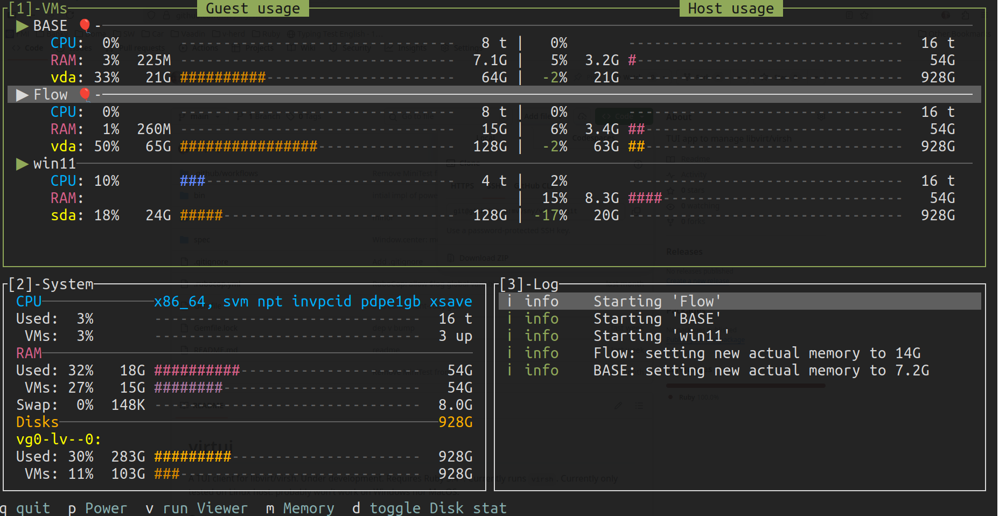

# virtui

A TUI client for libvirt/virsh. Requires Ruby 3.4+. 
Currently only tested on Linux host: probably won't work on Windows nor MacOS.



## Setup

- [Install Ruby via Mise](https://github.com/mvysny/lazyvim-ubuntu).
- git clone this project, then run `bundle install` to install project dependencies.
- To use virtui over `virsh` binary, run `sudo apt install libvirt-clients` (recommended, the default)
- To use direct connection to `libvirt` (experimental, [broken at the moment](https://github.com/mvysny/virtui/issues/1)),
  install the libvirt Ruby gem: `sudo apt install ruby-libvirt`
- To give your user control over virtual machines, add your user to `libvirt` group:
  `sudo usermod -aG libvirt $USER` and log out/log in.
- Virt-Manager provides a nice UI which sets up VMs and provides a local fast VM viewer: install `sudo apt install virt-manager`

## Running

```
bin/virtui
```

Press `1` to focus the VM list. Select a VM using up/down arrows, then press:

- `ps` - starts a VM
- `po` - sends a shutdown signal to the guest OS which should gracefully shut down the VM.
- `pr` - sends a reset signal to the guest OS to gracefully reboot the machine.
- `pR` - forcefully reboots the VM.
- `v` - runs a graphical viewer for the VM (`virt-manager` needs to be installed)
- `mb` - toggles automatic ballooning for a VM
- `mm` - disables automatic ballooning and gives the VM max memory configured for that VM. A quick mechanism
  when VM needs more memory fast.
- `d` - toggles disk stats for all VMs, not just running ones. Clutters the list a bit.

# Ballooning

"Balloon" is closely related to precise control and statistics of guest memory. When ballooning is enabled, you can see
how much memory the guest OS is using for programs, disk cache, and how much is free. There's more: you can also control
the amount of memory the guest OS can use, *while the guest OS is running*. So, if your guest OS isn't using much memory at the moment,
you can shrink its memory, decreasing the memory footprint of the VM on host and giving host back a bit of memory.

This is done by a 'balloon' program running on guest: it can 'inflate' itself by increasing its memory usage the guest OS.
Host hypervisor knows that 'balloon'-occupied memory is unused by the guest OS, and therefore free to use by the host OS.

When guest needs more memory, the balloon 'deflates': the 'balloon' program releases its memory. The VM starts using more memory on host OS,
but this gives the guest OS more memory to work with.

You can inflate and deflate the balloon as many times as you need. By default the balloon inflating and deflating is manual work:
you run `virsh setmem` to control the balloon size. However, virtui can do this automatically for you.

## Enabling Ballooning

Without ballooning properly enabled in your guest OS, virtui can't control the amount of memory
available to the guest OS. To enable ballooning:

- Make sure your VM libvirt xml file contains the `<memballoon>` device (it does by default when you create VMs via `virt-manager`)
- Guest QEMU agent is installed and running:
  - Linux: `sudo apt install qemu-guest-agent`; `systemctl status qemu-guest-agent` shows that the service is running.
  - Linux: `virtio_balloon` kernel module must be activated. Most modern Linux distros have the `virtio_balloon` kernel module baked in: it's not shown in `lsmod`,
    but it's always active so `modprobe virtio_balloon` isn't necessary.
  - Windows: Download and install `virtio-win-guest-tools.exe` from [windows virtio repo](https://fedorapeople.org/groups/virt/virtio-win/direct-downloads/archive-virtio/?C=M;O=D).

If the memory data doesn't seem to be updated in virtui:

- Either make sure your VM libvirt xml `<memballoon>` device contains the `<stats period='3' /> ` child element, OR
- in the Virtual Machine Manager (`sudo apt install virt-manager`) preferences, polling, make sure "Poll Memory stats" is checked.
  However, this only works when the Virtual Machine Manager window is open. Therefore, first option is preferred.

**Note:** refresh each 3 seconds may seem excessive, but this way Ballooning will have access to the most fresh data,
and can quickly ramp up RAM when it's needed. Actually, regardless of the setting, `virsh` refreshes the data once every 5 seconds anyway.

When ballooning is enabled properly in a VM, 🎈 is shown next to the VM name in virtui. If the balloon data is stale (not being refreshed), 🐢 is shown.

When virtui controls the app memory, an arrow is shown next to 🎈: up arrow indicates a memory increase,
down arrow indicates memory decrease, and a flat dash `-` indicates no change.

More info at [VirtIO Memory Ballooning](https://pmhahn.github.io/virtio-balloon/).

## Automatic Balloon inflate/deflate

A running VM with ballooning support is observed, and a decision is made every 2 seconds. If the memory usage goes above 65%, the VM memory is
increased immediately by 30%. This helps if there's a sudden VM memory demand.
If the memory usage goes below 55%, a memory is decreased by 10%, but this only happens every 10 seconds.

In other words, if VM needs memory, the memory is given immediately. Afterwards, the memory is slowly decreased as the usage goes down.

At the moment you need to edit virtui sources to configure this: edit `ballooning.rb`: the configuration starts at line 49.

# Developing

Run tests via:
```
$ bundle exec rake spec
```

# Future plans

- `+-` increases/shrinks active memory by 10% and disables automatic ballooning
- Add [libvirt](https://ruby.libvirt.org/) client: blocked by [bug #14](https://gitlab.com/libvirt/libvirt-ruby/-/issues/14)

