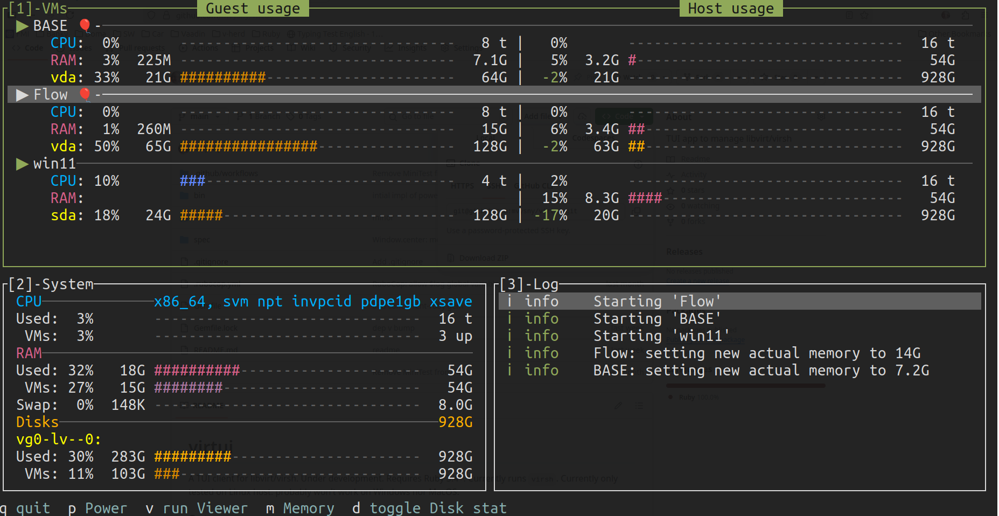

# virtui

A TUI client for libvirt/virsh. Requires Ruby 3.3+.
Currently only tested on Linux host: probably won't work on Windows nor MacOS.



## Setup

- Install Ruby 3.3+. On Ubuntu 26.04, `sudo apt install ruby ruby-dev` gives you Ruby 3.3.
  On other distros or if you need a specific version, [install Ruby via Mise](https://mise.jdx.dev/lang/ruby.html) instead.
- git clone this project. If you're on a system-wide (apt) Ruby, tell Bundler to install
  gems into your home directory so `bundle install` doesn't need root:
  ```
  bundle config set --global path ~/.gem
  bundle install
  ```
- Install the `virsh` binary via `sudo apt install libvirt-clients` — virtui shells out to `virsh` to talk to the libvirt daemon.
- To give your user control over virtual machines, add your user to `libvirt` group:
  `sudo usermod -aG libvirt $USER` and log out/log in.
- Virt-Manager provides a nice UI which sets up VMs and provides a local fast VM viewer: install `sudo apt install virt-manager`

## Running

```
bin/virtui
```

With no `virsh` on the `PATH`, virtui starts in demo mode instead: a fleet of four
simulated VMs you can start, stop and balloon, to try the UI out.

Press `1` to focus the VM list. Select a VM using up/down arrows, then press:

- `ps` - starts a VM
- `po` - sends a shutdown signal to the guest OS which should gracefully shut down the VM.
- `pr` - sends a reset signal to the guest OS to gracefully reboot the machine.
- `pR` - forcefully reboots the VM.
- `v` - runs a graphical viewer for the VM (`virt-manager` needs to be installed)
- `mb` - toggles automatic ballooning for a VM
- `mm` - disables automatic ballooning and gives the VM max memory configured for that VM. A quick mechanism
  when VM needs more memory fast.
- `d` - toggles disk stats for all VMs, not just running ones. Clutters the list a bit.

### Integrating Into Your Linux Desktop

Run:
```
$ bundle exec rake install_desktop
```

This creates a `.desktop` file for VirTUI and places it to
`~/.local/share/applications/`, as per the XDG spec.
The file is then picked by your Linux Desktop automatically.
The entry launches virtui in [Alacritty](https://alacritty.org/); install it, or edit
the `Exec=` line of the generated file for another terminal.

# Ballooning

"Balloon" is closely related to precise control and statistics of guest memory. When ballooning is enabled, you can see
how much memory the guest OS is using for programs, disk cache, and how much is free. There's more: you can also control
the amount of memory the guest OS can use, *while the guest OS is running*. So, if your guest OS isn't using much memory at the moment,
you can shrink its memory, decreasing the memory footprint of the VM on host and giving host back a bit of memory.

This is done by a 'balloon' program running on guest: it can 'inflate' itself by increasing its memory usage the guest OS.
Host hypervisor knows that 'balloon'-occupied memory is unused by the guest OS, and therefore free to use by the host OS.

When guest needs more memory, the balloon 'deflates': the 'balloon' program releases its memory. The VM starts using more memory on host OS,
but this gives the guest OS more memory to work with.

You can inflate and deflate the balloon as many times as you need. By default the balloon inflating and deflating is manual work:
you run `virsh setmem` to control the balloon size. However, virtui can do this automatically for you.

## Enabling Ballooning

Without ballooning properly enabled in your guest OS, virtui can't control the amount of memory
available to the guest OS. To enable ballooning:

- Make sure your VM libvirt xml file contains the `<memballoon>` device (it does by default when you create VMs via `virt-manager`)
- Guest QEMU agent is installed and running:
  - Linux: `sudo apt install qemu-guest-agent`; `systemctl status qemu-guest-agent` shows that the service is running.
  - Linux: `virtio_balloon` kernel module must be activated. Most modern Linux distros have the `virtio_balloon` kernel module baked in: it's not shown in `lsmod`,
    but it's always active so `modprobe virtio_balloon` isn't necessary.
  - Windows: Download and install `virtio-win-guest-tools.exe` from [windows virtio repo](https://fedorapeople.org/groups/virt/virtio-win/direct-downloads/archive-virtio/?C=M;O=D).

virtui enables guest memory-stat collection automatically: whenever it sees a VM running, it
arms the libvirt collection period (via `virsh dommemstat --period`) so the balloon stats stay
fresh. You don't need to configure anything for this to work — but if you prefer, you can make
it persistent across reboots by adding the `<stats period='3' />` child element to your VM's
`<memballoon>` device in the libvirt xml.

If the memory data still looks stuck (and 🐢 is shown), the VM most likely lacks a working
balloon device or guest tools — see the bullet list above.

When ballooning is enabled properly in a VM, 🎈 is shown next to the VM name in virtui. If the balloon data is stale (not being refreshed), 🐢 is shown.

When virtui controls the app memory, an arrow is shown next to 🎈: up arrow indicates a memory increase,
down arrow indicates memory decrease, and a flat dash `-` indicates no change.

A running VM whose balloon reports swap counters has a `SWAP` row under its RAM bar. It reads
in two halves, like the CPU and RAM rows above it:

```
    RAM: 50%    4G ########---------  7.9G │  16%  5.1G ##---------------   32G
   SWAP: 43%  1.8G #######----------    4G │       3M/s ##-------------- ↕ 1.8G
   SWAP:  -        -----------------       │        0/s ---------------- ↕    0
```

- **left — how full the guest's swap device is.** 1.8 GiB parked on a 4 GiB device above.
  Read it against the RAM bar directly above: that is the memory this guest wanted and did
  not get. It needs the guest agent (see below); `-` means this guest could not be asked,
  which is not the same as an empty swap device.
- **right — what that swapping costs the host,** since the guest's swap writes are writes to
  your disk: how fast pages are going out right now, then `↕` the total traffic in both
  directions since the guest booted. The rate drops back to `0/s` once the guest stops
  swapping, and the `SWAP` label turns yellow while it is non-zero.

The row itself stays whether or not the guest is swapping, so the VMs below it don't shift
around. A guest that reports no swap counters at all gets no row.

**To see the level,** virtui has to ask the guest, which needs two things:

1. `qemu-guest-agent` running in the guest — the same package the ballooning section asks for.
2. The VM's definition saying which OS it runs. virtui only asks a guest declared as Linux,
   because the level comes from the guest's `/proc/meminfo`. virt-manager and
   `virt-install --os-variant` write that declaration; a hand-written domain XML often does
   not, and `virsh metadata <vm> --uri http://libosinfo.org/xmlns/libvirt/domain/1.0` shows
   whether yours has it (`virsh edit <vm>` is where you add one).

The marker left of each VM's name is the family your definition declares — only 🐧 gets
asked for a swap level:

| | | | | | |
|---|---|---|---|---|---|
| 🐧 Linux | 🪟 Windows | 😈 FreeBSD | 🐡 OpenBSD | 🚩 NetBSD | 🐉 DragonFly BSD |
| 🍎 macOS | 🌞 Solaris | 💡 illumos | 🍃 Haiku | 💾 DOS | 🌐 NetWare |

A dim `?` means the definition names no OS at all — or names one virtui does not know, which
is worth [reporting](https://github.com/mvysny/virtui/issues), since the table covers every
OS libosinfo ships.

Guests that cannot answer — no agent, not declared Linux, or a distro that blocks the
agent's file-read commands — show `-` and are asked again a minute later.

More info at [VirtIO Memory Ballooning](https://pmhahn.github.io/virtio-balloon/).

## Automatic Balloon inflate/deflate

A running VM with ballooning support is observed, and a decision is made every 2 seconds. If the memory usage goes above 65%, the VM memory is
increased immediately by 30%. This helps if there's a sudden VM memory demand.
If the memory usage goes below 55%, a memory is decreased by 10%, but this only happens every 10 seconds.

In other words, if VM needs memory, the memory is given immediately. Afterwards, the memory is slowly decreased as the usage goes down.

**And separately, whenever the guest writes to its swap device**, virtui gives it the
same +30% — whatever the usage figure says — and then refuses to take memory away from it
for the next minute. Watch the SWAP row (above): a non-zero rate on the right is what
drives both.

This matters because a swapping guest *looks* like a guest with memory to spare. Pages
moved out to disk count as available memory again, so the usage figure above drops exactly
when the guest is short — it can sit unmoved at 55% while gigabytes go to disk. Left to
that figure alone a VM under load is never grown, and may even be shrunk while it swaps.

Two things to expect from it. A burst usually takes a few rounds to absorb, so the VM can
end up larger than it finally needs; the memory comes back over the following couple of
minutes as the ordinary shrink unwinds it. And a guest that writes to swap *continuously*
for reasons more memory cannot fix — a container or systemd slice with its own memory
limit inside the VM — will be grown to its configured maximum and stay there. If that is
your guest, turn ballooning off for that VM with `mb`.

At the moment you need to edit virtui sources to configure this. Each decision above is a
small class in `lib/virt/ballooning_vm/` holding its own threshold as an instance variable,
documented next to its value: the 65% and 55% triggers in `MemLevelRaiseVoter` and
`MemLevelShrinkVoter`, the swap rate that counts as swapping in `SwapOutRaiseVoter` and
`SwapOutShrinkVetoer`, the quiet-period lengths in the latter and in `BackOffShrinkVetoer`.
How far each change moves the memory — the 30% and the 10% — is set in `Virt::BallooningVM`
(`lib/virt/ballooning_vm.rb`), which is what runs them all.

## Guest Configuration

The most important setting is the guest Linux swappiness parameter. It's a value 0..100;
A higher value increases swapping, while a lower value reduces it.
Default value: 60 on most systems, meaning swap is used when RAM usage is around 40%.
This allows for bigger disk caches which improve system performance.
On guest OS however you don't need disk caches (the host OS caches qcow2 writes),
and you should prevent swapping unless absolutely necessary. The best way is to:

1. Set swappiness to 1 on guest: `echo 'vm.swappiness=1' | sudo tee /etc/sysctl.d/99-swappiness.conf`
2. Still have a swap file, to deal with sudden memory usage spikes.

# Developing

If you're on a system-wide (apt) Ruby, first point Bundler at your home directory
so `bundle install` doesn't need root (see [Setup](#setup)):
```
$ bundle config set --local path ~/.gem
$ bundle install
```

Run tests via:
```
$ bundle exec rake spec
```

# Future plans

- `+-` increases/shrinks active memory by 10% and disables automatic ballooning
- Add [libvirt](https://ruby.libvirt.org/) client instead of shelling out to `virsh`: blocked by
  [bug #1](https://github.com/mvysny/virtui/issues/1). See `DECISIONS.md` `D_virsh_cli`.

